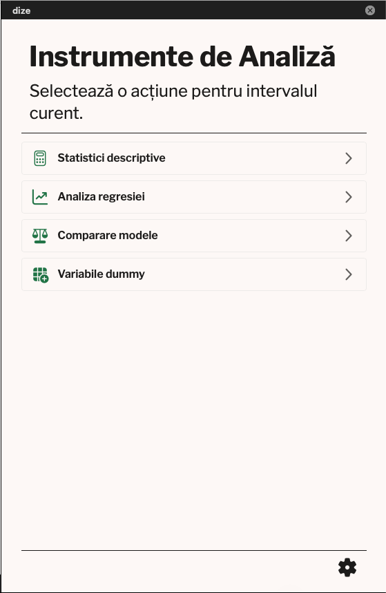
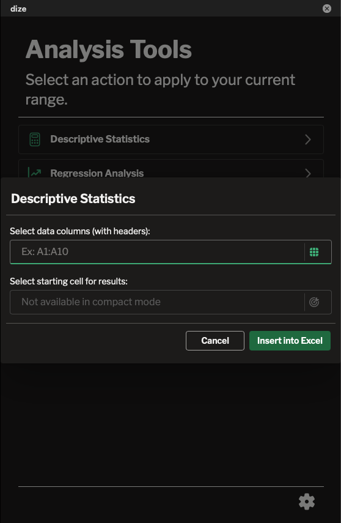
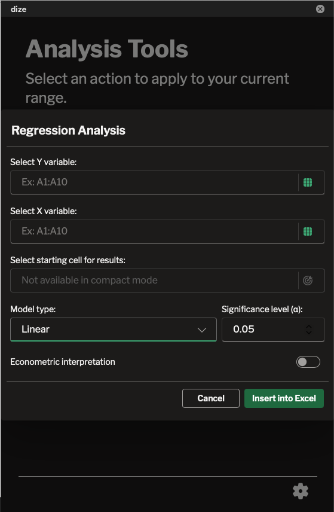
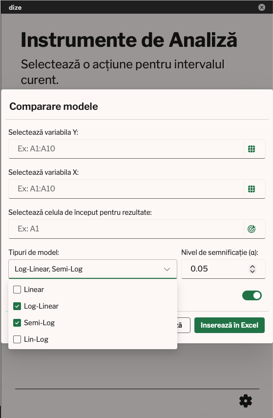
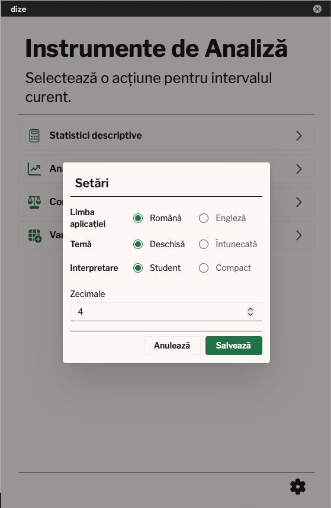

# dize

An Excel task pane add-in for quick econometric and statistical analysis, built with React and Fluent UI. It reads a range you select on the sheet, runs the calculation, and writes a formatted result back into the workbook — no separate stats software needed.

## Screenshots

| | |
|---|---|
|  |  |
|  |  |
|  |  |

## Features

- **Descriptive Statistics** — sample size, mean, standard deviation, standard error, and confidence interval for one or more selected columns.
- **Regression Analysis** — simple or multiple linear regression via OLS, with support for linear, log-linear, semi-log, and lin-log model forms. Optionally generates a full narrative econometric interpretation (significance tests, coefficient interpretation) alongside the standard "Summary Output" report (ANOVA, coefficients, VIF, correlation matrix).
- **Model Comparison** — runs two or more model types on the same data and recommends the best fit based on R² and RSS.
- **Dummy Variables** — converts a categorical column into 0/1 dummy columns, letting you pick the reference (baseline) category to avoid the dummy variable trap.

Additional touches:
- Bilingual interface (English / Romanian), switchable at any time.
- Light and dark theme.
- "Student" mode (full step-by-step interpretation) vs. "Compact" mode (writes a condensed result straight to a dedicated sheet).
- Configurable decimal precision for displayed numbers.

## How it works

Each tool opens as a dialog where you point to your data range(s) directly on the sheet (via a live range-selector), configure a few options, and submit — the add-in computes the result with `mathjs`/`jStat` and writes it back into Excel as a formatted table.

See [`docs/examples/output_examples.xlsx`](docs/examples/output_examples.xlsx) for real generated output: a `compact_mode_output` sheet, a `student_mode_output` sheet, and a `student_mode_dummy_output` sheet.

---

# dize (Română)
 
Un add-in de Excel (task pane) pentru analize statistice și econometrice rapide, construit cu React și Fluent UI. Selectezi un interval de date din foaie, add-in-ul face calculele și scrie rezultatul gata formatat direct în fișierul Excel — nu mai ai nevoie de un program de statistică separat.
 
## Ce știe să facă
 
- **Statistici descriptive** — număr de observații, medie, abatere standard, eroare standard și interval de încredere, pentru una sau mai multe coloane selectate.
- **Regresie** — regresie liniară simplă sau multiplă prin metoda celor mai mici pătrate (OLS), cu suport pentru modele liniare, log-liniare, semi-log și lin-log. Pe lângă raportul clasic de tip "Summary Output" (ANOVA, coeficienți, VIF, matrice de corelație), poate genera opțional și o interpretare econometrică narativă completă, cu teste de semnificație și explicarea coeficienților.
- **Comparare de modele** — rulează două sau mai multe tipuri de model pe aceleași date și îți recomandă varianta cea mai potrivită, pe baza R² și RSS.
- **Variabile dummy** — transformă o coloană categorială în coloane dummy 0/1 și te lasă să alegi categoria de referință, ca să eviți capcana variabilelor dummy.
În plus:
 
- Interfață bilingvă (engleză / română), poți schimba limba oricând.
- Temă luminoasă și temă întunecată.
- Mod "Student" (interpretare completă, pas cu pas) sau mod "Compact" (scrie doar un rezultat condensat, într-o foaie separată).
- Poți alege câte zecimale să fie afișate.
## Cum funcționează
 
Fiecare instrument se deschide într-un dialog în care alegi intervalul (sau intervalele) de date direct de pe foaie, cu un selector de interval live, bifezi câteva opțiuni și trimiți cererea. Add-in-ul face calculele cu `mathjs`/`jStat` și scrie rezultatul înapoi în Excel, sub forma unui tabel formatat.
 
În [`docs/examples/output_examples.xlsx`](docs/examples/output_examples.xlsx) găsești exemple reale de rezultate generate: foile `compact_mode_output`, `student_mode_output` și `student_mode_dummy_output`.
 
